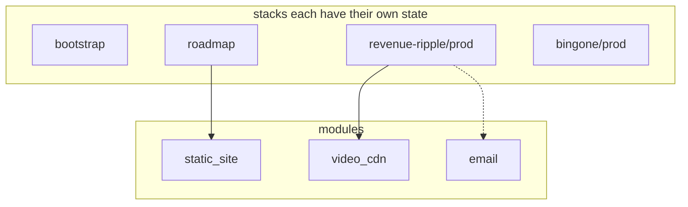

# terraform-practice

Portfolio lab **and** the single place that describes AWS for Willis apps.

App code stays in each app repo. This repo is the cookbook Terraform reads. There is only one cookbook per app, so AWS does not get two copies of the same bucket.

```
terraform-practice/
├── apps/roadmap/                 # Vite SPA (lab)
├── modules/                      # reusable building blocks (no state)
│   ├── static_site/
│   ├── video_cdn/
│   └── email/
└── stacks/                       # one folder = one terraform apply
    ├── bootstrap/                # state bucket + lock table (once)
    ├── roadmap/                  # lab static site
    ├── revenue-ripple/prod/     # video CDN (SES optional)
    └── bingone/prod/            # placeholder; import existing EC2 later
```

## Like you're five: why separate stacks?

Imagine two recipe cards that both say "make a chocolate cake."

If you follow **both** cards, you bake **two cakes**. Terraform is the same: each `terraform apply` looks at its own folder and creates whatever that folder describes. It does not look at the other folder to see if the cake already exists.

So:

- **Modules** = the recipe for "how to make a cake" (reusable).
- **Stacks** = which cake you are baking today (Revenue Ripple videos vs lab site vs binGone).
- **Never keep the same cake recipe in two places you can apply.** That is two sources of truth. Two applies = two buckets (or a nasty name-collision error).

That is why Revenue Ripple's Terraform no longer lives in the `revenue-ripple` app repo. Apply only:

```bash
cd stacks/revenue-ripple/prod
```

## Which folder do I `cd` into?

| I want to... | Folder | Safe to apply now? |
|---|---|---|
| Store Terraform state in S3 | `stacks/bootstrap` | Yes, once |
| Host the roadmap lab site | `stacks/roadmap` | Lab only |
| Create Revenue Ripple video S3 + CloudFront | `stacks/revenue-ripple/prod` | Yes — this is the video migration |
| Manage binGone's existing EC2 | `stacks/bingone/prod` | Not yet. Import first, do not recreate |

Each stack has its own state. Applying videos cannot create or destroy binGone's EC2.



## Credentials

No AWS keys belong in this repo. The provider uses the standard chain:

1. Environment: `AWS_ACCESS_KEY_ID` / `AWS_SECRET_ACCESS_KEY`
2. Shared config: `aws configure` (`~/.aws/credentials`)
3. Optional named profile: `aws_profile` in `terraform.tfvars` or `AWS_PROFILE`

`*.tfvars` (except `*.tfvars.example`), `*.tfstate*`, and `.terraform/` are gitignored.

## 1. Bootstrap remote state (once)

```bash
cp stacks/bootstrap/terraform.tfvars.example stacks/bootstrap/terraform.tfvars
# edit state_bucket_name so it is globally unique
cd stacks/bootstrap
terraform init
terraform plan
terraform apply
```

Then uncomment the `backend "s3"` block in each other stack's `versions.tf`, using the same bucket and table, but a **different `key`** per stack.

## 2. Revenue Ripple video CDN

This is the S3 + CloudFront migration. SES stays off until you set `enable_email = true`.

```bash
cp stacks/revenue-ripple/prod/terraform.tfvars.example stacks/revenue-ripple/prod/terraform.tfvars
cd stacks/revenue-ripple/prod
terraform init
terraform plan
terraform apply
```

Outputs you will use in the Revenue Ripple app:

| Output | Use |
|---|---|
| `cloudfront_distribution_domain_name` | Playback URL host |
| `s3_video_bucket_name` | Upload target |
| `render_uploader_iam_user_name` | Create access keys in the IAM console, not in Terraform |

## 3. Roadmap lab site

Requires Terraform `>= 1.5.0` and Node 18+.

```bash
npm install
npm run dev
```

Provision:

```bash
cp stacks/roadmap/terraform.tfvars.example stacks/roadmap/terraform.tfvars
cd stacks/roadmap
terraform init
terraform plan
terraform apply
```

`random_pet` appends two words to `project_name` so the lab bucket name is unique. `force_destroy = true` is lab-only, not used on Revenue Ripple videos.

Publish a build from the repo root, after apply:

```bash
npm run build

aws s3 sync apps/roadmap/dist "s3://$(terraform -chdir=stacks/roadmap output -raw bucket_name)" --delete

aws cloudfront create-invalidation \
  --distribution-id "$(terraform -chdir=stacks/roadmap output -raw distribution_id)" \
  --paths "/*"
```

CloudFront maps 403/404 to `/index.html` so client-side routes still work.

### Published progress (read-only for visitors)

The live site loads `progress.json` and does **not** let visitors change chips. You edit locally (`npm run dev`), then publish with your IAM user (S3 `PutObject`). There is no public write API.

```bash
npm run dev
# cycle chips, click "Download progress.json"
# replace apps/roadmap/public/progress.json with the download

npm run write-progress   # optional: rebuild the file from skill defaults
npm run publish-progress # aws s3 cp + invalidate /progress.json
```

The business card fetches `https://<cloudfront>/progress.json` (CORS is set on the distribution).

## 4. binGone (later)

`stacks/bingone/prod` is empty on purpose. binGone already has EC2. Write matching resources, then `terraform import` — do not `apply` a new instance first.

## Lab notes

- **Cost:** CloudFront `PriceClass_100` (US, Canada, Europe). Tear the lab down with `terraform -chdir=stacks/roadmap destroy`. Do not run destroy from a folder that manages production.
- **Security posture (videos and lab):** public access blocked, `BucketOwnerEnforced`, SSE-S3, CloudFront OAC (SigV4).
- **PHI:** this stack must not hold protected health information.
