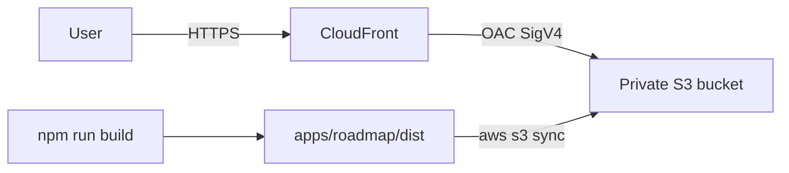

# terraform-practice

Portfolio lab for **Willis Empire Group · Cloud Division**: a React 19 cloud-engineering roadmap SPA, deployed as a static site through private **S3 + CloudFront Origin Access Control**.

This is an npm-workspaces monorepo. The app is a client-only tracker (progress lives in `localStorage`). Terraform is the source of truth for hosting. Do not store PHI here — this stack is a public study site, not a covered-entity system.

```
terraform-practice/
├── package.json                 # npm workspaces orchestration
├── apps/roadmap/                # Vite + React 19 SPA
└── infra/                       # AWS root module + static_site child module
    └── modules/static_site/
```



## Run the roadmap locally

Requires Node 18+.

```bash
npm install
npm run dev
```

That starts Vite in `apps/roadmap`. Other root scripts:

| Script | What it runs |
| --- | --- |
| `npm run build` | Production `dist/` for S3 |
| `npm run preview` | Local preview of the production build |
| `npm run lint` | oxlint on the SPA |

Progress is stored in this browser under `roadmap-progress-v1`. Click a skill card for study notes; cycle the status chip to mark not started / in progress / done.

## Provision the static site

Requires Terraform `>= 1.5.0` and AWS credentials (see below).

```bash
cp infra/terraform.tfvars.example infra/terraform.tfvars   # first time only
cd infra
terraform init
terraform plan
terraform apply
```

`random_pet` appends two words to `project_name` so the bucket name is unique. Provider `default_tags` stamp every tagged resource with `Project` and `ManagedBy = terraform`.

Outputs you will use:

| Output | Use |
| --- | --- |
| `cloudfront_url` | HTTPS URL of the site |
| `bucket_name` | Target for `aws s3 sync` |
| `distribution_id` | CloudFront cache invalidation after a sync |

## Publish a build

From the repo root, after `terraform apply`:

```bash
npm run build

aws s3 sync apps/roadmap/dist "s3://$(terraform -chdir=infra output -raw bucket_name)" --delete

aws cloudfront create-invalidation \
  --distribution-id "$(terraform -chdir=infra output -raw distribution_id)" \
  --paths "/*"
```

CloudFront maps 403/404 to `/index.html` (HTTP 200) so client-side routes still work. There is no custom domain, ACM, or Route 53 in this lab.

## Credentials

No AWS keys belong in this repo. The provider uses the standard chain:

1. Environment: `AWS_ACCESS_KEY_ID` / `AWS_SECRET_ACCESS_KEY`
2. Shared config: `aws configure` (`~/.aws/credentials`)
3. Optional named profile: `aws_profile` in `infra/terraform.tfvars` or `AWS_PROFILE`

`*.tfvars` (except `*.tfvars.example`), `*.tfstate*`, and `.terraform/` are gitignored.

## Lab notes

- **Cost:** CloudFront `PriceClass_100` (US, Canada, Europe). Tear the lab down when you are done: `terraform -chdir=infra destroy`. The bucket has `force_destroy = true` so destroy works with objects still in it — that flag is lab-only, not production policy.
- **Security posture:** public access is fully blocked, `BucketOwnerEnforced`, SSE-S3 (AES256). The bucket is not a website endpoint. CloudFront is the only reader, via OAC (SigV4) and a bucket policy conditioned on this distribution ARN.
- **PHI:** this stack must not hold protected health information. HIPAA reference architecture is a later roadmap phase, not this module.

## Next step (not in this repo yet)

Remote state with S3 + DynamoDB locking is a Terraform Associate (Phase 2) exercise. Do not add a backend or long-lived CI apply keys until that lab. A later Phase 3 pass can add GitHub Actions that only run `terraform fmt` / `validate` (and OIDC, not static keys).
